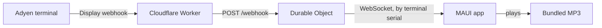

# Architecture



The whole server side is one Cloudflare Worker and one Durable Object. There is no database, no
accounts, and no stored state.

## Relay

- `POST /webhook` receives Adyen's Display notification (JSON, 64 KiB max). Only an approved
  `TENDER_FINAL` result is forwarded. The terminal serial is taken from `POIID` (`V400m-324688170`
  gives `324688170`).
- `GET /ws/<terminalSerial>` upgrades to a WebSocket. The single Durable Object (`RelayObject`) tags
  each socket with its serial (hibernatable WebSockets) and sends a notification only to sockets with
  the matching serial. If none are connected the notification is dropped: nothing is queued or replayed.
- `GET /health` returns `{"status":"ok"}`. Anything else returns `404`.

Invalid input gets a plain error (`400`, `405`, `413`, `415`, `426`); a valid webhook always gets `202`
so Adyen never retries.

## Message

The server pushes one JSON envelope per approved payment. The client sends nothing and ignores nothing
it doesn't understand: unsupported or malformed envelopes are skipped.

```json
{"protocol":2,"message":{"id":"payment:<pspReference>","type":"payment_succeeded",
 "occurredAt":"2026-09-18T12:00:00.000Z","terminalId":"V400m-324688170",
 "transactionId":"<tx>.<pspReference>","pspReference":"<pspReference>"}}
```

## App

- `AdyenOutLoud.Core` (plain `net10.0`, no MAUI): connection loop with reconnect backoff, envelope
  parsing, duplicate suppression (a small cache of recent event IDs), configuration.
- `AdyenOutLoud` (MAUI: Android, iOS, Mac Catalyst, Windows): view model, WebSocket, `Preferences`
  storage, and `MauiAudioPlayer`, which plays `Resources/Raw/{PaymentReceived,TestAnnouncement}-{EN,ZH,MS,TA}.mp3`.
- The relay URL is compiled in (`RelayEndpointFactory.DefaultBaseUrl`); Debug builds accept an
  `ADYEN_OUT_LOUD_RELAY_URL` override. Only the terminal serial and language are saved on the device.
- Android, Windows, and Mac Catalyst keep listening in the background; iOS is foreground-only.

## Why it is built this way

- **One shared relay, no tokens** ([ADR 0008](adr/0008-single-shared-relay-and-prerecorded-audio.md)):
  nothing is stored, so there is little to protect and no setup to do beyond Adyen's webhook.
- **Pre-recorded audio:** consistent quality in all four languages on every platform.
- **Display webhook only:** it carries no amount or payment method, so the message is always generic.

See [ADR 0001](adr/0001-use-dotnet-maui.md) and [ADR 0002](adr/0002-use-cloudflare-durable-objects.md)
for the platform choices.
