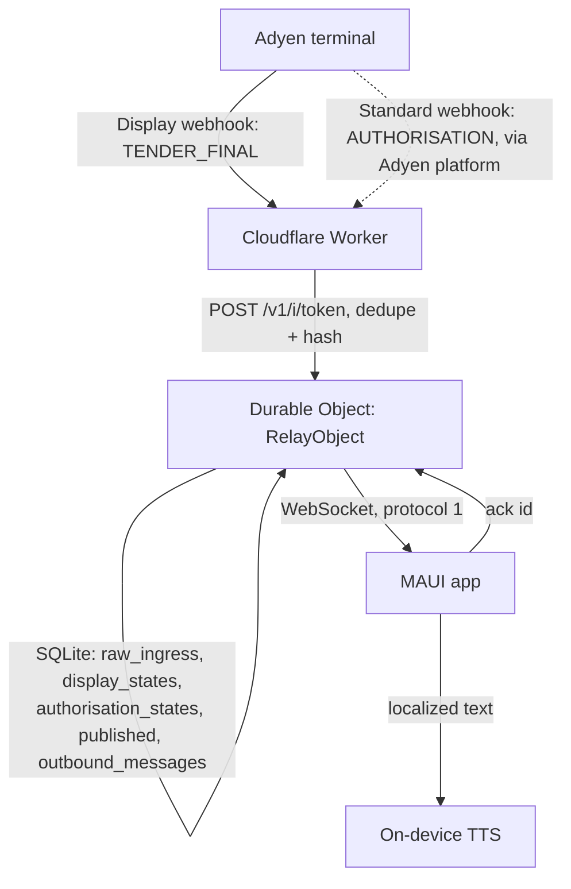

# Architecture

Adyen Out Loud turns a successful terminal payment into a spoken confirmation on a phone,
tablet, or PC near the till. There is no merchant backend to run and nothing to provision beyond
pasting one URL into Adyen — a Cloudflare Worker is the entire server side, and each app instance
gets its own isolated Durable Object on first launch.

## End-to-end flow



Two independent Adyen notifications describe one payment:

- **Display** (`SaleToPOIRequest.DisplayRequest`, event `TENDER_FINAL`) comes straight from the
  terminal and is authoritative about whether the *terminal* considers the payment approved. It
  carries the terminal ID but no payment method or amount.
- **Standard** (`notificationItems[].NotificationRequestItem`, event `AUTHORISATION`) comes from
  Adyen's platform and carries payment method and amount, but can arrive seconds before or after
  the Display notification, or not at all (declines, connectivity issues).

The Worker's job is to correlate the two by `pspReference` and publish exactly one outbound
message per successful payment, either **rich** (both notifications) or **generic** (Display only,
after a bounded wait). See [`worker/src/adyen/payment-correlator.ts`](../worker/src/adyen/payment-correlator.ts)
for the correlation rule and [`docs/adr/0005-correlate-display-and-standard-webhooks.md`](adr/0005-correlate-display-and-standard-webhooks.md)
for why.

## Instance identity and routing

There is no sign-up flow and no central database of instances. On first launch the app generates
32 cryptographically random bytes, base64url-encodes them into a 43-character token, and stores it
in platform secure storage (Keychain / Keystore / Credential Locker). That token *is* the
instance's identity:

```text
Webhook:   https://<worker-host>/v1/i/<token>
WebSocket: wss://<worker-host>/v1/i/<token>/ws
```

The Worker never stores a token-to-Durable-Object mapping table. It derives the Durable Object's
name deterministically as `SHA-256(token)` (base64url), then calls
`env.PAYMENT_CHANNELS.idFromName(name)`. The first request for a given token causes Cloudflare to
create that Durable Object; every later request for the same token routes to the same object. This
is what "zero provisioning" means in practice — see
[`docs/adr/0003-zero-provisioning-instance-token-routing.md`](adr/0003-zero-provisioning-instance-token-routing.md)
and, importantly, [`docs/threat-model.md`](threat-model.md) for what this design deliberately does
*not* protect against (the token is a bearer secret, not an HMAC-verified webhook).

## HTTP ingress ([`worker/src/index.ts`](../worker/src/index.ts))

`fetch()` is intentionally thin: validate the request envelope, route, delegate.

1. `GET /health` → `{"status":"ok"}`, no token required.
2. `POST /v1/i/<token>` (ingest) — token must match `^[A-Za-z0-9_-]{43}$` *and* decode to exactly
   32 bytes, `Content-Type` must be JSON, and the body is streamed with a 64 KiB hard cap (rejecting
   oversized bodies before they reach the Durable Object). The body is parsed once here purely to
   compute a **dedupe key** (see below); the Durable Object re-parses and interprets it.
3. `GET /v1/i/<token>/ws` (WebSocket) — same token validation, requires an `Upgrade: websocket`
   header.

Any other path, or a malformed token, returns `404` — the Worker does not distinguish "wrong
token" from "no such route" in its response, so the public surface can't be used to enumerate
valid tokens.

## Deduplication before persistence

Adyen retries webhooks, and a retry is not always byte-identical (whitespace, key order, or a
`reason` field can differ). `index.ts` computes two hashes over the parsed JSON before handing off
to the Durable Object:

- `stableIngressFields()` — extracts the fields that make a notification semantically the *same
  event* (for a Display notification: `pspReference` + `result` + `transactionId`; for Standard
  Authorisation items: `pspReference` + `successful` + `occurredAt`). Recognized-but-differently-shaped
  payloads that fail this extraction fall back to a constant, so they still dedupe against exact
  repeats.
- `canonicalJson()` — a key-sorted, deterministic JSON serialization, hashed to catch
  byte-for-byte-different-but-content-identical retries the stable-fields pass didn't already
  distinguish.

`dedupeKey = SHA-256(stableFields + "|" + normalizedHash)` is passed to the Durable Object as a
header; `raw_ingress` has `dedupe_key` as its primary key with `INSERT OR IGNORE`, so a retried
webhook is durably absorbed without ever running the parser twice.

## Durable Object ([`worker/src/relay-object.ts`](../worker/src/relay-object.ts))

One `RelayObject` per instance token, backed by its own SQLite storage (Durable Objects SQLite
storage, not a shared database). See [`docs/adr/0002-use-cloudflare-durable-objects.md`](adr/0002-use-cloudflare-durable-objects.md).

**Schema** (versioned by the `migrations` block in `wrangler.jsonc`; see
[Schema and migrations](#schema-and-migrations) below):

| Table | Purpose |
| --- | --- |
| `raw_ingress` | Every deduplicated webhook body, keyed by `dedupe_key`, with `processed_at`/`processing_error` for observability and idempotent reprocessing. |
| `display_states` | Parsed Display (`TENDER_FINAL`) state per `psp_reference`, with `deadline_at` — the time by which a generic (payment-method-less) announcement fires if no matching authorisation shows up. |
| `authorisation_states` | Parsed Standard AUTHORISATION state per `psp_reference`. |
| `published` | One row per `psp_reference` that has ever been published — the durable "have we already announced this" guard. |
| `outbound_messages` | The bounded, ordered replay log the WebSocket sends on (re)connect. |

**Ingress → correlation.** `ingest()` inserts into `raw_ingress` (`INSERT OR IGNORE`, so a
duplicate delivery is a no-op), arms an alarm at `now + CORRELATION_WAIT_MS` (5 seconds), and — only
for a genuinely new row — kicks off `processRaw()` via `ctx.waitUntil()` so the HTTP response
(`202`) doesn't wait on parsing. `processRaw()` parses the stored body, upserts whichever of
`display_states` / `authorisation_states` it recognizes, and calls `tryPublish()` for every
`pspReference` it touched.

**Correlation rule** ([`payment-correlator.ts`](../worker/src/adyen/payment-correlator.ts)): publish
only once, only for a *successful* Display. If a successful Authorisation is already known, publish
rich (with payment method and amount). Otherwise, wait until `deadline_at`; if it passes with still
no successful Authorisation, publish generic (payment method and amount both `null`). A failed or
missing Authorisation never blocks or retries the generic fallback, and once published, a later
Authorisation can never upgrade or duplicate that announcement (`published` already has the row).

**Alarm** does three jobs each time it fires: drain any `raw_ingress` rows that failed to process
inline (crash recovery), publish any Display rows whose deadline has passed, and prune retained data
older than `RETENTION_MS` (24 hours). `scheduleNextAlarm()` then either reschedules for the next
pending item or clears the alarm — there is never an idle polling loop.

## WebSocket delivery, ACKs, and replay

The Worker uses [hibernatable WebSockets](https://developers.cloudflare.com/durable-objects/best-practices/websockets/)
(`ctx.acceptWebSocket`) so an idle connection doesn't pin the Durable Object in memory between
messages. On connect, the object replays every row currently in `outbound_messages`, in insertion
order — this is how a client that was offline when a payment happened still gets the announcement
once it reconnects.

The client's only outbound message is `{"type":"ack","id":"<message id>"}`
(see [`docs/protocol.md`](protocol.md)). A well-formed ACK deletes the row from
`outbound_messages` for **every** connected socket, not just the one that sent it — acknowledgment
is per-message, not per-connection, matching "at most one logical announcement" even with two
devices connected to the same instance. Anything else closes the socket with code `1008`.

## Client architecture (MAUI)

```text
AdyenOutLoud.Core            (net10.0, no MAUI/platform reference — see ADR 0001)
    Models/                  PaymentMessage, AppLanguage, VoiceLocale, RelayStatus, ...
    Abstractions/            interfaces the MAUI project implements against platform APIs
    Services/                RelayConnectionService, PaymentAnnouncementService,
                              InstanceIdentityService, RelayProtocol (WS parsing),
                              SpeechLocaleSelector, CurrencyFormatter, ResxLocalizationService, ...
    Resources/Strings*.resx  localized announcement templates (en, zh, ms, ta)

AdyenOutLoud                 (net10.0-android / -ios / -maccatalyst / -windows10.0.19041.0)
    ViewModels/MainViewModel  UI state + commands only, binds to Core abstractions via DI
    Services/                 thin platform adapters: ClientWebSocketConnection, MauiSpeechService,
                               SecureStorageTokenStore, PreferencesSettingsService
    MainPage.xaml              compiled bindings (x:DataType), no business logic in code-behind
```

`AdyenOutLoud.Core` has zero project references and must never reference `Microsoft.Maui`, Android,
iOS/UIKit, or Windows assemblies — enforced by
[`AdyenOutLoud.ArchitectureTests`](../app/AdyenOutLoud.ArchitectureTests) on every PR, not just by
convention. `RelayConnectionService` owns the reconnect loop (exponential backoff, capped at 30s),
status/diagnostic events, and lifecycle-aware start/stop; `AppLifecycleCoordinator` in the MAUI
project just calls `Start()`/`StopAsync()` from the platform's foreground/background hooks. The
WebSocket therefore only runs while the app is foregrounded — see
[`docs/threat-model.md`](threat-model.md) for what that implies about missed-while-backgrounded
events (answer: nothing is lost, because the Worker replays on reconnect).

## Dependency direction

```text
Worker:  index.ts (HTTP) ──▶ relay-object.ts (Durable Object) ──▶ adyen/* (pure parsing/correlation)
                                                                 ──▶ identity.ts (pure hashing)
         adyen/* and identity.ts import nothing Cloudflare-specific — enforced by
         .dependency-cruiser.cjs, run in CI (`npm run architecture`).

MAUI:    AdyenOutLoud (app, platform adapters) ──▶ AdyenOutLoud.Core (pure C#)
         Core never references the app project — enforced by AdyenOutLoud.ArchitectureTests.
```

## Schema and migrations

Durable Object SQLite schema changes are additive `CREATE TABLE IF NOT EXISTS` /
`CREATE INDEX IF NOT EXISTS` statements run in the `RelayObject` constructor, so they're idempotent
across every existing and future object. `wrangler.jsonc`'s `migrations` array
(`new_sqlite_classes: ["RelayObject"]`, tag `v1`) is what allocates SQLite-backed storage for the
class in the first place; a genuine breaking schema change (renaming or dropping a column tables
depend on) would need a new migration tag plus an explicit backfill step, not just an edit to the
`CREATE TABLE` statement, since the *existing* SQLite files on already-created objects aren't
re-run against a changed schema definition.

Indexes exist for exactly the queries the Durable Object runs on a hot path: `raw_pending` (alarm's
"find unprocessed rows" scan) and `display_deadlines` (alarm's "find Display rows whose generic-fallback
deadline has passed" scan). There is no index on `authorisation_states` or `published` beyond their
primary keys, because every other lookup is a single-row lookup by `psp_reference`.

## Protocol versioning

The WebSocket envelope carries `"protocol": 1` explicitly (see [`docs/protocol.md`](protocol.md)).
The client rejects (ignores, with a diagnostic) any envelope whose `protocol` isn't exactly `1` or
whose `message.type` isn't `"payment_succeeded"` — this is deliberate: a structurally incompatible
future protocol version must never be guessed at or partially interpreted.
