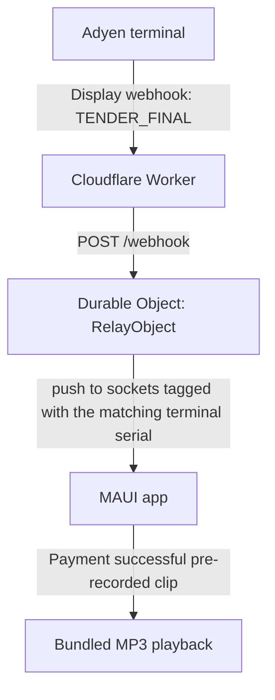

# Architecture

Adyen Out Loud turns a successful terminal payment into a spoken confirmation on a phone, tablet,
or PC near the till. There is no merchant backend to run and nothing to provision beyond pasting
one URL into Adyen — a Cloudflare Worker is the entire server side: a single Durable Object holds
every terminal's WebSocket, tagged by terminal serial.

## End-to-end flow



The Worker only ingests Adyen's Display notification (`SaleToPOIRequest.DisplayRequest`, event
`TENDER_FINAL`) — the notification the terminal itself sends, and the only one that's authoritative
about whether the *terminal* considers the payment approved. It never carries payment method or
amount, so every announcement is the same generic "payment successful." There is no second
notification type to correlate and nothing to persist — see
[ADR 0007](adr/0007-display-only-stateless-company-scoped-relay.md) for why, including the
trade-offs it deliberately accepts.

## Terminal identity and routing

There is no sign-up flow, no per-company secret, and no central database. Whoever has Adyen Customer
Area access configures one **Display** webhook, once, pointing at the shared relay:

```text
Webhook:   https://adyenoutloud.adam-eea.workers.dev/webhook
```

Each app instance is configured with only the device's **terminal serial number** — the part of
Adyen's terminal ID after the model prefix (e.g. `324688170` from `V400m-324688170`). The relay URL
is compiled into the app. It derives its WebSocket URL:

```text
WebSocket: wss://adyenoutloud.adam-eea.workers.dev/ws/<terminalSerial>
```

The Worker routes everything to a single Durable Object (`RELAY_OBJECT_NAME` in
[`worker/src/ingress-rules.ts`](../worker/src/ingress-rules.ts)). Each terminal's WebSocket
connection is tagged with its terminal serial (Cloudflare's hibernatable-WebSocket tag API); ingesting
a notification fans it out only to connections tagged with the serial recovered from the
notification's `POIID`. A notification for a terminal with no connected app is dropped. See
[`docs/threat-model.md`](threat-model.md) for what this design deliberately does *not* protect
against, and [ADR 0008](adr/0008-single-shared-relay-and-prerecorded-audio.md) for why.

## HTTP ingress ([`worker/src/index.ts`](../worker/src/index.ts))

`fetch()` is intentionally thin: validate the request envelope, route, delegate.

1. `GET /health` → `{"status":"ok"}`.
2. `POST /webhook` (ingest) — `Content-Type` must be JSON, and the body is streamed with a 64 KiB
   hard cap (rejecting oversized bodies before they reach the Durable Object). The body is checked
   for valid JSON syntax here (a fast `400` for a malformed webhook), then forwarded to the Durable
   Object unparsed.
3. `GET /ws/<terminalSerial>` (WebSocket) — the terminal serial is validated against
   `^[A-Za-z0-9_-]{1,64}$` and an `Upgrade: websocket` header is required.

Any other path, or a malformed terminal serial, returns `404`.

## Durable Object ([`worker/src/relay-object.ts`](../worker/src/relay-object.ts))

A single `RelayObject` — see [ADR 0002](adr/0002-use-cloudflare-durable-objects.md).
It holds **no durable state at all**: no SQLite tables, no alarm, nothing written to storage. `fetch()` handles two
internal routes:

- `POST /ingest` — parses the Display webhook body; if it's a successful `TENDER_FINAL`, derives
  the terminal serial from `POIID` and pushes a generic `payment_succeeded` envelope to every
  currently-connected socket tagged with that serial (`ctx.getWebSockets(terminalSerial)`). A
  declined or unrecognized notification, or one with no connected socket for its terminal, is a
  silent no-op — always `202 Accepted` regardless, so Adyen never retry-storms the endpoint.
- `GET /ws` — accepts a new [hibernatable WebSocket](https://developers.cloudflare.com/durable-objects/best-practices/websockets/)
  connection, tagged with the terminal serial from its query string
  (`ctx.acceptWebSocket(socket, [terminalSerial])`) — hibernation means an idle connection doesn't
  pin the Durable Object in memory between messages.

There is nothing to replay on reconnect: a client that was disconnected when a payment happened
does not receive it later. This is a deliberate trade-off for statelessness — see
[ADR 0007](adr/0007-display-only-stateless-company-scoped-relay.md#consequences).

## WebSocket delivery

The connection is a pure server-to-client push. The client sends no ACK, no hello, and no identity
message — identity is carried entirely by the terminal serial in the URL path,
which the Worker already validated during the HTTP upgrade. Any message a client does send is
ignored (`webSocketMessage` is a no-op) — there's no server-side state left for an acknowledgment to
reconcile against, so the protocol doesn't have one. See [`docs/protocol.md`](protocol.md) for the
exact wire format.

## Client architecture (MAUI)

```text
AdyenOutLoud.Core            (net10.0, no MAUI/platform reference — see ADR 0001)
    Models/                  PaymentMessage, AppLanguage, AnnouncementSound, RelayStatus,
                              RelayConfiguration, ...
    Abstractions/            interfaces the MAUI project implements against platform APIs
    Services/                RelayConnectionService, PaymentAnnouncementService,
                              RelayConfigurationService, RelayProtocol (WS parsing),
                              IAnnouncementPlayer (abstraction), ...

AdyenOutLoud                 (net10.0-android / -ios / -maccatalyst / -windows10.0.19041.0)
    ViewModels/MainViewModel  UI state + commands only, binds to Core abstractions via DI
    Services/                 thin platform adapters: ClientWebSocketConnection, MauiAudioPlayer,
                               PreferencesRelayConfigurationStore, PreferencesSettingsService
    Platforms/<X>/            per-platform pieces, including BackgroundExecutionService (below)
                               and, on Android, PaymentListenerForegroundService
    Resources/Raw/*.mp3        pre-recorded announcements (PaymentReceived/TestAnnouncement x EN, ZH, MS, TA)
    MainPage.xaml              compiled bindings (x:DataType), no business logic in code-behind
```

`AdyenOutLoud.Core` has zero project references and must never reference `Microsoft.Maui`, Android,
iOS/UIKit, or Windows assemblies — enforced by
[`AdyenOutLoud.ArchitectureTests`](../app/AdyenOutLoud.ArchitectureTests) on every PR, not just by
convention. `RelayConnectionService` owns the reconnect loop (exponential backoff, capped at 30s),
status/diagnostic events, and lifecycle-aware start/stop; it reads the saved relay configuration
(`IRelayConfigurationService`) at connect time and reports `NeedsAttention` if the app hasn't been
configured yet, rather than looping forever.

**Background execution** is delegated to `IBackgroundExecutionService`, implemented once per
platform under `Platforms/<X>/BackgroundExecutionService.cs` and wired into
`AppLifecycleCoordinator`'s foreground/background transitions:

- **Android** starts a real foreground service (`PaymentListenerForegroundService`, with a
  persistent low-importance notification) on background, so the process — and the relay
  connection's own reconnect loop, unchanged — isn't suspended; it's stopped again on return to the
  foreground.
- **Windows and Mac Catalyst** are no-ops: desktop apps aren't suspended when minimized, so the
  relay connection is simply never stopped on background/foreground transitions.
- **iOS** stops the relay connection on background and reconnects on foreground — true background
   WebSocket listening on iOS would require the "audio" background mode, which Apple can reject for
   an app not playing continuous audio; this project stays foreground-only there by deliberate
   choice rather than risk that workaround.

## Dependency direction

```text
Worker:  index.ts (HTTP) ──▶ relay-object.ts (Durable Object) ──▶ adyen/* (pure parsing)

         adyen/* imports nothing Cloudflare-specific — enforced by
         .dependency-cruiser.cjs, run in CI (`npm run architecture`).

MAUI:    AdyenOutLoud (app, platform adapters) ──▶ AdyenOutLoud.Core (pure C#)
         Core never references the app project — enforced by AdyenOutLoud.ArchitectureTests.
```

## Protocol versioning

The WebSocket envelope carries `"protocol": 2` explicitly (see [`docs/protocol.md`](protocol.md)).
The client rejects (ignores, with a diagnostic) any envelope whose `protocol` isn't exactly `2` or
whose `message.type` isn't `"payment_succeeded"` — this is deliberate: a structurally incompatible
future protocol version must never be guessed at or partially interpreted.
