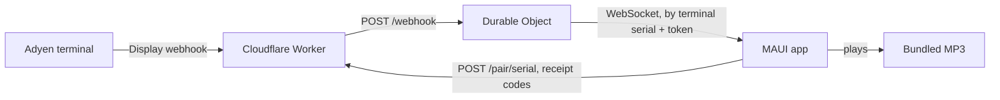

# Architecture



The whole server side is one Cloudflare Worker and one Durable Object. There is no database and no
accounts; the Durable Object's storage holds only what pairing needs (see the
[threat model](threat-model.md#pairing)).

## Relay

- `POST /webhook` receives Adyen's Display notification (JSON, 64 KiB max) from the IP addresses
  `out.adyen.com` resolves to only. Only an approved `TENDER_FINAL` result is forwarded, and the end of
  its PSP reference is remembered for pairing. The terminal serial is taken from `POIID`
  (`V400m-324688170` gives `324688170`).
- `POST /pair/<terminalSerial>` takes `{"receipts":["AB12","CD34"]}` (1 KiB max): the last 4 characters
  of the PSP references of two recent approved payments. It returns `{"token":"..."}`, `403` if they
  don't match, or `429` after too many failures. Rules are in `worker/src/pairing.ts`.
- `GET /ws/<terminalSerial>` with `Authorization: Bearer <token>` upgrades to a WebSocket (`401`
  without a valid token). The single Durable Object (`RelayObject`) tags each socket with its serial
  (hibernatable WebSockets) and sends a notification only to sockets with the matching serial. If none
  are connected the notification is dropped: nothing is queued or replayed.
- `GET /health` returns `{"status":"ok"}`. Anything else returns `404`.

Invalid input gets a plain error (`400`, `401`, `403` for a non-Adyen address, `405`, `413`, `415`, `426`).
A valid webhook always gets `202` so Adyen never retries; if Adyen's addresses can't be resolved the
Worker returns `503` and Adyen retries.

## Message

The server pushes one JSON envelope per approved payment. The client sends nothing and ignores nothing
it doesn't understand: unsupported or malformed envelopes are skipped.

```json
{"protocol":2,"message":{"id":"payment:<pspReference>","type":"payment_succeeded",
 "occurredAt":"2026-09-18T12:00:00.000Z","terminalId":"V400m-324688170",
 "transactionId":"<tx>.<pspReference>","pspReference":"<pspReference>"}}
```

## App

- `AdyenOutLoud.Core` (plain `net10.0`, no MAUI): connection loop with reconnect backoff, envelope
  parsing, duplicate suppression (a small cache of recent event IDs), pairing and configuration.
- `AdyenOutLoud` (MAUI: Android, iOS, Mac Catalyst, Windows): view model, WebSocket, `Preferences`
  storage, and `MauiAudioPlayer`, which plays `Resources/Raw/{PaymentReceived,TestAnnouncement}-{EN,ZH,MS,TA}.mp3`.
- The relay URL is compiled in (`RelayEndpointFactory.DefaultBaseUrl`); Debug builds accept an
  `ADYEN_OUT_LOUD_RELAY_URL` override. The device saves the terminal serial, its token, and the language.
- Android, Windows, and Mac Catalyst keep listening in the background; iOS is foreground-only.

## Why it is built this way

- **One shared relay** ([ADR 0008](adr/0008-single-shared-relay-and-prerecorded-audio.md)): no
  per-account URL or secret to configure beyond Adyen's webhook.
- **Pairing with receipt codes** ([ADR 0009](adr/0009-pair-devices-with-receipt-codes.md)): only a
  device that can see the terminal's receipts can listen, still with no accounts or Customer Area access.
- **Pre-recorded audio:** consistent quality in all four languages on every platform.
- **Display webhook only:** it carries no amount or payment method, so the message is always generic.

See [ADR 0001](adr/0001-use-dotnet-maui.md) and [ADR 0002](adr/0002-use-cloudflare-durable-objects.md)
for the platform choices.
