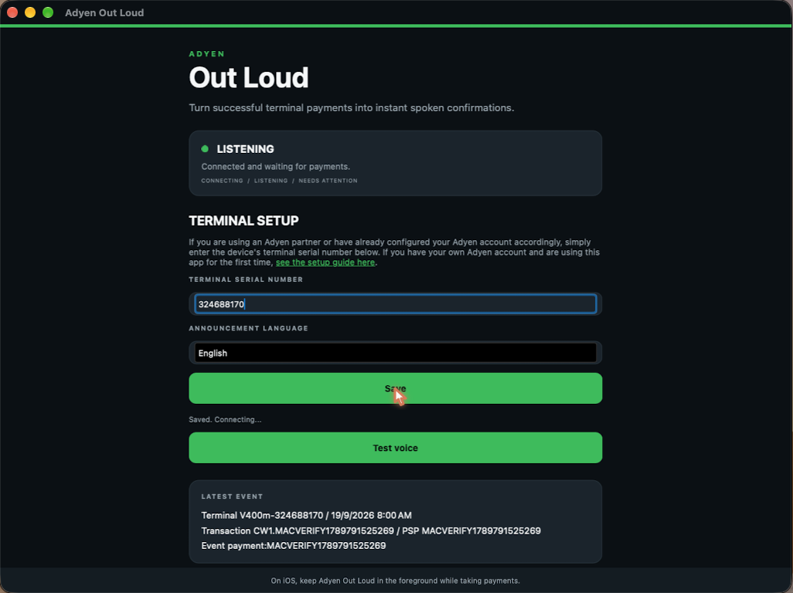

# Adyen Out Loud — set-up guide

Adyen Out Loud plays a spoken "Payment successful" on a phone, tablet, or computer next to the till
whenever a terminal payment is approved, in English, Chinese, Malay, or Tamil.

> **Unofficial project.** "Adyen" is a trademark of Adyen N.V. This project is independent and not
> affiliated with, endorsed by, or supported by Adyen.

Setup has two parts. If you use an Adyen partner that has already done part 1 for you, skip to part 2.

## 1. Add the webhook in your Adyen account (once)

Someone with Adyen Customer Area access creates a **Display webhook** (Terminal API notifications)
pointing at:

```text
https://adyenoutloud.adam-eea.workers.dev/webhook
```

Use method `POST` with JSON content, and make sure it is active. It is the same URL for everyone, and
it is the only webhook the app needs. See Adyen's
[webhook documentation](https://docs.adyen.com/development-resources/webhooks/) if you can't find the
setting.

## 2. Set up the app on each device



1. Open the app and enter the terminal's **serial number**: the part of the terminal ID after the
   model prefix (`324688170` from `V400m-324688170`; it is also printed on the terminal).
2. Choose the announcement language and tap **Save**. The status changes to **LISTENING**.
3. Tap **Test voice** to hear the announcement, then take a payment. It appears under **Latest
   event** and the recording plays within a few seconds.

If nothing plays, check that the status says **LISTENING**, the serial matches exactly, the webhook is
active, and the volume is up. On iOS the app must stay in the foreground.

## Good to know

- Only approved payments are announced, always with the same message: Adyen's Display notification
  has no amount or payment method.
- Nothing is stored. A device that is offline when a payment happens misses it.
- The terminal serial is the only thing that routes a message, and it isn't secret, so **don't treat
  an announcement as proof of payment**. See the [threat model](threat-model.md).
- For account issues use [Adyen's support](https://www.adyen.com/contact), and never paste live payment
  data into a GitHub issue.
